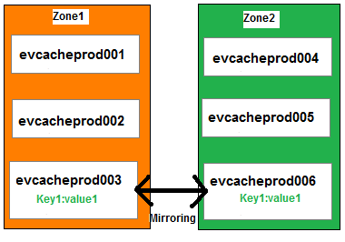

# Features
- A distributed, replicated cache with a simple memcached-semantics interface (get, set, touch, delete, etc.)
- Linear scalability of overall data size or network capacity (vs getting a bigger box)
- Any number of copies of data are supported (some clusters run with 2, others with 9)
- Resiliency to failure. Individual instances can die, and do so regularly, without affecting client applications (many of the services at Netflix that use EVCache do so as a solitary storage mechanism, meaning the data has no other place it resides besides in EVCache.)
- Operations have topological awareness, retries, fallbacks, and other mechanisms to ensure successful completion (Optimization for AWS architecture)
- The data in each key can be of any size (with data chunking)
- Transparent nearline global data replication 
- Seamless cache deployments with no data loss
- Detailed Insights into operation and performance
- In short: memcached is a single process that works very well on a single server. EVCache takes this and uses it as a fundamental building block.
- Data is replicated across all regions using a custom Data Replication Service
- When any maintenance needs to be perfomed like
	- deploying new AMI
	- increasing or decreasing the cluster size  
data from the old clusters are copied to new clusters

## Key canonicalization
- A key is "canonicalized" by prepending the cache prefix and the ":" character. For example, if the prefix is "cid", the key is "foo" the key will be canonicalized to cid:foo. This eliminates namespace collisions when multiple caches share a single memcached instance.

## Consistency
- This service makes no consistency guarantees whatsoever. Specifically:
- It is purely best-effort
- There is no guarantee that the contents of two caches will converge

## Discovery
- The process of finding suitable caches is mediated by Discovery. The EVCache servers advertise themselves as EVCache App and register with discovery service. 
- The clients looking for a EVCache instances belonging to a particular app get the list of instances from Discovery and the EVCache client manages them.

## Mirroring/Replication
- Data is always mirrored (replicated) between zones. That is, two cache servers in differing zones supporting the same cache will contain the same data.
- Within a zone, data will be sharded across the set of instances. The sharding of the data is based on Ketama consisten hashing algorithm.

## Read Retries 
- In general, caches in the local zone are preferred while reading.
- If no caches are available within your zone, a cache from another zone is chosen at random.
	- Note that if you are sharding, adding a cache instance is a disruptive process, because it changes the results of the consistent hashing algorithm. Some fraction of the cache's entries will become unreachable, and they will languish in obscurity until their object lifetimes are reached. Storing the item anew will result it in being assigned to the correct node, and the cache will then behave as expected.

## Connection Pools and Management
- Create a Pool of connections to each EVCache App at startup
- Separate pools for Read and Write Operations

## Resilient to state in Discovery
- Be passive when disconnecting from EVCache server i.e. if discovery drops a server the client should not remove it until the connection is lost. 
- Verification of instance replacement before rehashing. This ensures key movement is minimized when disruptions happen.
- ServerGroup config can be provided by System properties or FastProperties and can be used to bootstrap. Ideal for situations where the client is in a non Discovery/Eureka environment.
- Uses spinnaker API as a backup to find EVCache instances

## Write only Clusters
- Set a Server Group/zone to write only mode
- We can employ this when we are changing cluster sizes or pushing new AMI

## Latch based API
- Status about write operations can be obtained using Latch.
- Can be used to block for a specified duration until the latch policy is met.

## GC Pauses
- Read operation caught in-flight can linger after pause before failing or retrying

## Dynamic compression
- EVCache Transcoder can be configured to perform data compression dynamically
- Decompression will be done only if the compress flag is set

## Client side caching
- LRU based in-memory caching inside of EVCache client.
- Can be enabled dynamically and transparent to the app. 
- Ideal for immutable objects with duplicate reads in short duration.

## MBeans & JMX Operations 
- Connection Status
- Queue length for Reads, Writes and input
- Cache Hits/Misses for read Operations
- Errors and Timeouts
- Active & Inactive Instance
- Refresh connections 
- Clear the Operation Queue

## Typical EVCache Cluster Example

